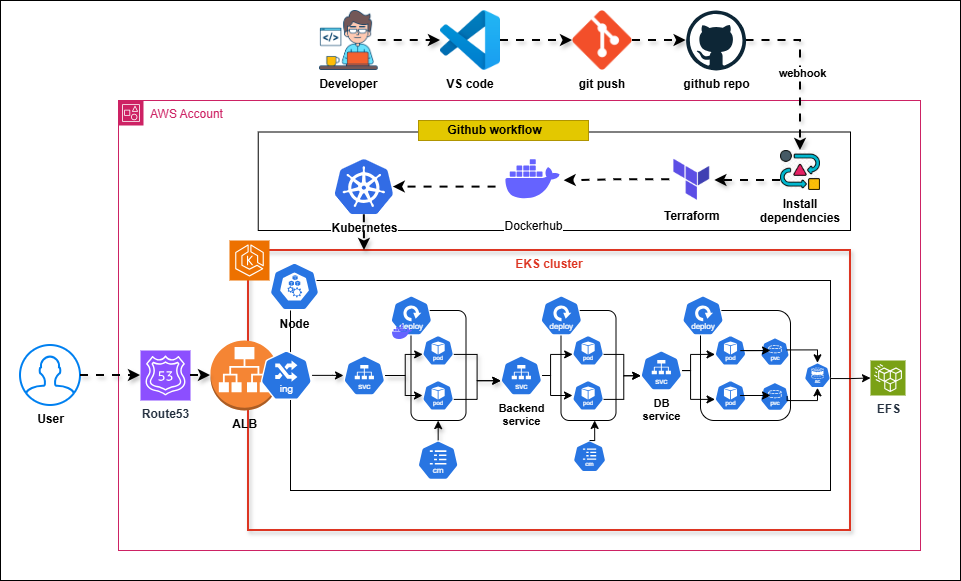

# 🌟 Expense Tracker - 3-Tier Architecture


## Features

✅ **3-Tier Architecture** - Clean separation of concerns between frontend, backend, and database

✅ **Automated CI/CD Pipeline** - Fully automated deployment using GitHub Actions

✅ **Infrastructure as Code** - AWS resources provisioned with Terraform

✅ **Containerized Applications** - Docker containers for both frontend and backend

✅ **Kubernetes Orchestration** - Scalable deployment using Helm charts

✅ **Database Management** - MySQL database with proper security configurations

✅ **Health Monitoring** - Built-in health check endpoints

✅ **Responsive UI** - Modern React-based frontend interface

✅ **Scalability** - Horizontal pod autoscaling for backend services

---

## Tech Stack

### **Primary Languages & Tools**
- **Infrastructure Provisioning**: Terraform
- **Backend**: Node.js, Express.js, MySQL
- **Frontend**: React.js
- **Containerization**: Docker
- **Orchestration**: Kubernetes (EKS)
- **CI/CD**: GitHub Actions
- **Load Balancing**: AWS Application Load Balancer
- **Monitoring**: Built-in logging and health checks

### Project Architecture

---
## CI/CD Architecture

This project uses a **stage-wise CI/CD pipeline** built with **GitHub Actions**, **Terraform**, **Docker**, **Helm**, and **Amazon EKS** to automate infrastructure provisioning and application deployment.

The pipeline is manually triggered and deploys the application in a controlled order:

Infrastructure → Backend → Frontend.


---

### Stage 1: Infrastructure Provisioning

**Job Name:** infrastructure  
**Trigger:** Manual (`workflow_dispatch`)

#### Description
This stage provisions all required AWS resources using Terraform in a layered approach to maintain dependencies.

#### Terraform Layers
- VPC
- Security Groups
- Bastion Host
- RDS (Database)
- Amazon EKS Cluster
- ACM Certificate
- Application Load Balancer (Ingress)

#### Terraform Architecture


#### Key Actions
- Terraform `init` and `apply` for each layer
- Extracts **Frontend Target Group ARN**
- Exposes Target Group ARN as a pipeline output

---

### Stage 2: Backend CI/CD

**Job Name:** backend-deploy  
**Depends On:** infrastructure

#### Description
This stage builds, pushes, and deploys the backend service to Amazon EKS.

#### Steps
1. Read backend version from `package.json`
2. Build Docker image for backend
3. Push image to Docker Hub
4. Update kubeconfig for EKS
5. Deploy backend using Helm

#### Deployment Details
- Kubernetes Namespace: `expense`
- Image Tagging: Version-based
- Deployment Strategy: Rolling updates

---

### Stage 3: Frontend CI/CD

**Job Name:** frontend-deploy  
**Depends On:** backend-deploy

#### Description
This stage builds and deploys the frontend application and integrates it with AWS ALB.

#### Steps
1. Read frontend version from `package.json`
2. Build Docker image for frontend
3. Push image to Docker Hub
4. Install AWS Load Balancer Controller CRDs
5. Deploy AWS Load Balancer Controller
6. Wait for controller and webhook readiness
7. Deploy frontend using Helm with Target Group binding

#### Deployment Details
- Public access via Application Load Balancer
- Target Group ARN injected dynamically
- Image pull policy set to `Always`

---

### Secrets & Configuration

#### GitHub Secrets
- `AWS_ACCESS_KEY_ID`
- `AWS_SECRET_ACCESS_KEY`
- `DOCKERHUB_USERNAME`
- `DOCKERHUB_TOKEN`

#### Environment Variables
- `AWS_REGION`
- `EKS_CLUSTER_NAME`
- Application version from `package.json`

---

### Container & Deployment Strategy

- Containerization: Docker
- Orchestration: Kubernetes (EKS)
- Packaging: Helm Charts
- Ingress: AWS Application Load Balancer
- Image Versioning: Semantic versioning

---

### Benefits of This CI/CD Design

- Fully automated end-to-end deployment
- Infrastructure as Code (IaC)
- Version-controlled Docker images
- Scalable and production-ready setup
- Secure secret handling
- Zero-downtime deployments

---


### **Quick Start**

1. **Clone the repository**:
   ```bash
   git clone https://github.com/yourusername/devops-fresher-assignment.git
   cd devops-fresher-assignment
   ```

2. **Set up AWS credentials**:
   ```bash
   aws configure
   ```
   Enter your AWS Access Key ID, Secret Access Key, default region (e.g., `us-east-1`), and default output format (e.g., `json`).

3. **Deploy Infrastructure**:
   ```bash
   # Navigate to Terraform directory
   cd terraform

   # Initialize Terraform
   terraform init

   # Apply Terraform configuration
   terraform apply -auto-approve
   ```

4. **Run Github workflow**
   - Creates infra using terraform
   - Build docker image and pushed to docker
   - Run the docker image using Kubernetes
---

## 🎯 Usage

### **Frontend Access**

After deployment, access the frontend through the Application Load Balancer URL or Route53 provided by Terraform. The frontend will automatically fetch and display transactions from the backend API.

---

## 📁 Project Structure

```
devops-fresher-assignment/
├── backend/                  # Backend application
│   ├── Dockerfile            # Backend Docker configuration
│   ├── index.js              # Express.js application
│   ├── package.json          # Backend dependencies
│   ├── TransactionService.js # Database operations
│   ├── DbConfig.js           # Database configuration
│   ├── schema/backend.sql    # Database schema
│   ├── helm/                 # Helm charts for Kubernetes deployment
│   │   ├── Chart.yaml
│   │   ├── templates/
│   │   └── values.yaml
│   └── .gitignore
│
├── frontend/                 # Frontend application
│   ├── Dockerfile            # Frontend Docker configuration
│   ├── index.html            # Entry HTML file
│   ├── package.json          # Frontend dependencies
│   ├── code/                 # React application files
│   ├── helm/                 # Helm charts for Kubernetes deployment
│   │   ├── Chart.yaml
│   │   ├── templates/
│   │   └── values.yaml
│   └── .gitignore
│
├── terraform/                # Infrastructure as Code
│   ├── 00-vpc/               # VPC configuration
│   ├── 10-sg/                # Security groups
│   ├── 20-bastion/           # Bastion host
│   ├── 30-db/                # Database configuration
│   ├── 40-eks/               # EKS cluster
│   ├── 50-acm/               # ACM certificates
│   └── 60-ingress-alb/       # ALB configuration
│
├── .github/workflows/        # GitHub Actions workflows
│   └── expense-deploy.yaml   # CI/CD pipeline
│
├── .gitignore                # Global gitignore file
└── README.md                 # This file
```

---

## 🔧 Configuration

### **Environment Variables**

The backend application uses the following environment variables:

| Variable      | Description                          | Default Value                     |
|---------------|--------------------------------------|-----------------------------------|
| `DB_HOST`     | MySQL database host                   | `db-dev.eswarsaikumar.site`       |
| `DB_USER`     | MySQL database username               | `expense`                         |
| `DB_PWD`      | MySQL database password               | `ExpenseApp@1`                    |
| `DB_DATABASE` | MySQL database name                   | `transactions`                    |

### **Customizing the Application**

1. **Database Configuration**:
   Modify the `DbConfig.js` file in the backend directory to change database credentials.

2. **Helm Values**:
   Update the Helm values in the `backend/helm/values.yaml` and `frontend/helm/values.yaml` files to customize deployment settings like replica counts and image versions.

3. **Terraform Variables**:
   Customize the Terraform variables in the respective modules to adjust infrastructure settings.

---

### **Future Improvements**

- **Serverless Backend**: Migrate backend to AWS Lambda for cost efficiency.
- **Microservices**: Split backend into multiple microservices for better scalability.
- **CI/CD Pipeline Enhancements**: Add more stages for testing and security scanning.

